# High-Level Design: World Model Integration for Agentic Storytelling

**Status:** Proposal
**Date:** 2026-03-25
**Scope:** End-to-end integration of the agentic world-model harness into the story editor frontend

---

## Table of Contents

1. [Current State](#1-current-state)
2. [Problem Statement](#2-problem-statement)
3. [User Stories](#3-user-stories)
4. [User Experience Design](#4-user-experience-design)
5. [Data Architecture](#5-data-architecture)
6. [Agentic Harness Integration](#6-agentic-harness-integration)
7. [Backend Architecture (FastAPI)](#7-backend-architecture-fastapi)
8. [Frontend Architecture](#8-frontend-architecture)
9. [End-to-End Flows](#9-end-to-end-flows)
10. [Implementation Phases](#10-implementation-phases)
11. [Risks & Open Decisions](#11-risks--open-decisions)

---

## 1. Current State

### 1.1 The Frontend Editor

The application is a browser-based rich text editor for fiction writers, built with:

- **React 18** + **Mantine 8** (UI framework) + **Tiptap 3** (rich text editor with toolbar: headings, bold/italic, lists, code blocks, etc.)
- **Vite** for bundling and dev server
- **No routing library** — single-page application, single view
- **No backend** — everything runs in the browser

**Workspace model:** The writer's project is a recursive tree of files and folders stored as a single JSON object in `localStorage`:

```
workspace (root folder)
├── story-structure/ (folder)
│   ├── opening-scene.story (file, content = HTML string)
│   └── character-arc.story (file)
├── reference-notes/ (folder)
│   └── tone-guide.story (file)
└── workspace-log.story (file)
```

Each node has `{ id, name, type: 'file' | 'folder', children?, content? }`. File content is the raw HTML output of the Tiptap editor (e.g., `<h1>Opening scene</h1><p>Start close to the character...</p>`).

**Persistence:** Content is autosaved to `localStorage` on every keystroke. The writer can download the entire workspace as a `.zip` file (containing a `workspace.json` with the full tree) and later upload a `.zip` to restore it.

**Components:**

| Component | Role |
|-----------|------|
| `App.jsx` | Root orchestrator. Owns workspace state, tree selection, dialog management, project import/export. |
| `Sidebar.jsx` | Left panel: file/folder tree browser, "New" menu, "Project" menu (download/upload/reset). |
| `Topbar.jsx` | Header: breadcrumb, title, rename/delete actions, status badge. |
| `EditorPane.jsx` | Main area: Tiptap rich text editor (file selected), folder contents view (folder selected), or empty-state prompt (nothing selected). |
| `WorkspaceDialog.jsx` | Modal dialogs for create file/folder, rename, delete, reset project. |

**Utility modules:**

| Module | Role |
|--------|------|
| `utils/tree.js` | Immutable tree operations: add, rename, delete, find, path resolution, content update. |
| `utils/projectArchive.js` | Zip export/import using JSZip + browser-fs-access. Archive format: `{ app, version: 1, workspace, selectedNodeId }`. |
| `data/initialTree.js` | Starter workspace template with sample files. |

### 1.2 The Agentic Harness (Version-3.ipynb)

The notebook implements a **4-stage pipeline** that reads a manuscript diff (story changes) and maintains a structured world model using LLM agents with human-in-the-loop review.

**LLM configuration:** ChatGroq with `qwen/qwen3-32b`, temperature 0, max_tokens 8000, timeout 120s.

**Pipeline stages:**

| Stage | Agent | Input | Output | Human Review |
|-------|-------|-------|--------|--------------|
| 1 | EventIndexAgent | `events.md` + diff | `EventAgentOutput` (create/update/delete events) | Approve or reject with feedback |
| 2 | ElementIndexAgent | `elements.md` + diff | `ElementsProposal` (identify elements, match existing) | Approve or reject with feedback |
| 3 | ElementDetailAgent | Per-element context + diff | `ElementFileUpdateProposal` (section-level add/remove) | Approve or reject each, one at a time |
| 4 | EventDetailAgent | Per-event context + diff | `EventFileUpdateProposal` (section-level add/remove) | Approve or reject each, one at a time |

**World model structure on disk:**

```
story/
├── elements.md              # Pipe-delimited index: kind | display_name | uuid | aliases | identification_keys
├── elements/
│   ├── elt_45d617e4531b.md  # Detail file: sections (Core Understanding, Stable Profile, Chronology, etc.)
│   ├── elt_03e8d4548117.md
│   └── ...
├── events.md                # Pipe-delimited index: uuid | when | chapters | summary
└── events/
    ├── evt_f72bc8fe0f29.md  # Detail file: sections (Core Understanding, Causal Context, Participants, etc.)
    └── ...
```

**Key classes:**

- `BaseLayerAccessor` — Reads/writes index and detail markdown files. Handles UUID generation, validation, repair. Provides `apply_create()`, `apply_update()`, `apply_delete()`.
- `BaseAgentHarness` — LLM call orchestration with feedback loop. Maintains proposal history. `call()` → `format_proposal()` → `approve()` / `reject(feedback)`.
- `BaseDetailPageHarness` — Extends harness for per-file iteration. `set_targets()` → `propose_page()` → `approve_page()` / `reject_page()`. Handles parse → propose → merge → diff → write cycle.

**Feedback mechanism:** When the user rejects a proposal, the current proposal JSON + feedback text are appended to a history list. On the next LLM call, all history entries are prepended as user messages, giving the LLM full context of prior attempts and their rejections.

**Element index agent special behavior:** After the initial LLM call, an automatic coverage audit checks for:
- Missing person/place/group/relationship/concept entries that the diff clearly references
- Kinship cues without corresponding person/relationship entries
- Entities named in the proposal's own summary but missing from the identified elements list

If gaps are found, it auto-rejects with targeted feedback and retries once before presenting to the human.

### 1.3 The Gap

These two systems are completely disconnected:

- The **frontend** knows nothing about elements, events, or the world model. It is a text editor.
- The **harness** runs in a Jupyter notebook, reads/writes files on disk, and expects a human operator at the terminal.
- There is no API layer connecting them.
- The zip archive does not include any world model data.
- There is no mechanism to track what story content has been synced vs. what has changed since the last sync.

The writer currently cannot: browse their world model, trigger the harness from the UI, review proposals visually, provide feedback through the editor, or persist the world model across sessions.

---

## 2. Problem Statement

### 2.1 What the Writer Needs

A fiction writer building a saga needs to maintain a **consistent, navigable model of their world** — the characters, places, items, events, and timeline that make up the story. Today, this world model exists only in the writer's head (error-prone, doesn't scale) or in the Jupyter notebook output (developer-facing, not writer-friendly).

The writer needs to:

1. **Write freely** in a clean, distraction-free editor — then **step back** and see the structured world that emerges from their prose.
2. **Control when** the world model updates. Not every keystroke, but at meaningful milestones.
3. **Review what the AI proposes** before it becomes part of the canonical world model. The writer is the authority; the AI is a librarian.
4. **Guide the AI** with feedback when proposals are wrong, incomplete, or miss the point.
5. **Choose what to sync** — not every change is ready for the world model.
6. **Carry the world model** with the project — download, backup, share, and restore without losing state.
7. **Reference the world model** while writing — quickly look up a character's profile or an event's timeline without losing their place.

### 2.2 Core Challenges

| Challenge | Why It's Hard |
|-----------|---------------|
| **Context switching** | Writing is creative/immersive. World inspection is analytical/structured. The UI must serve both without making either worse. |
| **Change tracking** | The editor autosaves continuously, but world model syncs are deliberate. We need to track what changed since the last sync — like git tracks uncommitted changes. |
| **Multi-step review** | The pipeline has 4 stages, each with potential multiple feedback rounds. The review UX must guide the writer through this without overwhelming them. |
| **Persistence across sessions** | The world model, sync state, and unsynced diff must all survive zip download/upload and browser storage. |
| **Format bridging** | The editor produces HTML. The harness consumes markdown diffs. The world model is stored as pipe-delimited markdown. All three formats must interconvert cleanly. |

---

## 3. User Stories

### US-1: First World Model Creation

> **As a writer**, I want to create a world model from my existing story content, so that the AI can begin tracking my characters, places, and events.

**Scenario:** Priya has been writing chapters 1-3 of her saga in the editor. She's introduced several characters and a key location. She switches to the World view and sees "No world model yet." She clicks "Sync World Model," sees her full story content listed as new (since nothing has been synced before), confirms the file selection, and the pipeline runs. She reviews and approves the events and elements the AI identifies. Her world model is now populated with characters like "Mira" and "Arun," places like "Saint Alder Chapel," and a timeline of events.

**Acceptance criteria:**
- First sync treats all story content as new (full content = additions in the diff)
- Empty world model is created and populated through the pipeline
- Writer reviews and approves each stage before it's applied

---

### US-2: Browsing the World Model

> **As a writer**, I want to browse my world model organized by category, so that I can verify what the AI knows about my story and spot inconsistencies.

**Scenario:** Priya switches to World mode and sees her elements grouped: People (Mira, Arun, Elias, Sister Celine), Places (Saint Alder Chapel), Items (Silver Key, Cloth Bundle, Cracked Watch). She clicks on "Mira" and reads the full detail view — Core Understanding, Stable Profile, Chronology by chapter, Open Threads. She notices the chronology is missing an event from chapter 2 and makes a mental note to check if that part of the story was included in the last sync.

**Acceptance criteria:**
- Elements grouped by kind (person, place, item, etc.) in the sidebar
- Events grouped by chapter/time period
- Detail view shows all sections as collapsible panels
- TBD/empty sections are shown with a muted placeholder
- Overview dashboard shows counts, last sync time, sync status

---

### US-3: Syncing After Significant Edits

> **As a writer**, I want to sync the world model after I've made meaningful story changes, so that the world model stays current with my prose.

**Scenario:** Priya has rewritten chapter 4, adding a new character and a plot twist. She switches to World mode, sees "2 files changed since last sync," and clicks "Sync World Model." She sees a diff preview of her changes (green/red lines), confirms the file selection, and starts the sync. The AI proposes a new event and a new element. She approves both. The detail agents then propose updates to existing elements affected by the new chapter. She approves most, gives feedback on one ("Mira doesn't know about the twist yet — she only learns it in chapter 5"), and the AI revises. Once done, the world model reflects her latest writing.

**Acceptance criteria:**
- Diff preview shows file-by-file changes since last sync
- Writer can select which files to include
- Pipeline runs in sequence: events index → elements index → element details → event details
- Each stage shows the proposal for review before applying
- Approved changes are applied to the world model immediately

---

### US-4: Providing Feedback During Review

> **As a writer**, I want to reject a proposal and give the AI specific feedback, so that it can improve its understanding of my story.

**Scenario:** During element detail review, the AI proposes that "Arun is Mira's brother." Priya knows this is wrong — Arun is Mira's childhood friend, not her brother. She clicks "Request Changes," types "Arun is Mira's childhood friend, not her brother. They grew up in the same village but are not related," and submits. The AI returns a revised proposal with the correction. She approves.

**Acceptance criteria:**
- "Request Changes" button opens a feedback textarea
- Feedback is sent to the backend, which re-calls the LLM with full history
- The revised proposal replaces the previous one in the review UI
- Writer can see this is "Attempt #2" (or #3, etc.)
- Multiple rejection rounds are supported

---

### US-5: Selecting Which Files to Sync

> **As a writer**, I want to choose which changed files are included in a sync, so that I can keep draft/experimental content out of the world model until it's ready.

**Scenario:** Priya has edited `chapter-04.story` (finished) and `chapter-05-draft.story` (rough, experimental). When she starts a sync, the diff preview shows both files. She unchecks `chapter-05-draft.story`. The sync only processes changes from chapter 4. Chapter 5's changes remain unsynced and will appear again next time she syncs.

**Acceptance criteria:**
- Diff preview shows all changed files with checkboxes
- Unchecked files are excluded from the diff sent to the harness
- Excluded files remain unsynced (their changes appear in the next sync)
- At least one file must be selected to start the sync

---

### US-6: Downloading Project with World Model

> **As a writer**, I want my zip download to include the world model, so that I can back up and restore everything.

**Scenario:** Priya downloads her project. The zip contains her workspace files as before, plus the world model data (elements index, events index, all detail files) and the sync state. When she uploads this zip on another browser or after clearing storage, everything is restored — the file tree, the world model, and the sync status.

**Acceptance criteria:**
- Zip includes `workspace.json` with world model and sync state
- Zip includes `world-model/` directory with raw markdown files (portable, notebook-compatible)
- Upload restores all state: workspace tree, world model, sync state
- Backward compatible: uploading a v1 zip (no world model) still works

---

### US-7: Download Warning When Unsynced

> **As a writer**, I want to be warned before downloading if my world model is out of date, so that I don't lose track of unsynced changes.

**Scenario:** Priya has edited two chapters but hasn't synced the world model. She clicks "Download." A dialog appears: "Your world model hasn't been synced with recent story changes. 2 files have changed since the last sync." Options: "Sync First" (goes to sync), "Download Anyway" (proceeds, preserves unsynced state in zip), "Cancel." She chooses "Download Anyway." The zip includes the unsynced state, so when she reloads it later, the system still knows which files need syncing.

**Acceptance criteria:**
- Download checks sync status before proceeding
- Dialog shows if unsynced, with three options
- "Download Anyway" preserves `syncState` including `lastSyncedSnapshot` in the zip
- On reload, unsynced files are correctly detected

---

### US-8: Loading a Project and Resuming

> **As a writer**, I want to load a previously downloaded project and resume exactly where I left off, including world model state and pending syncs.

**Scenario:** Priya loads a zip she downloaded yesterday. The file tree is restored. She switches to World mode and sees her 9 elements and 7 events. The status shows "3 files changed since last sync" — the same unsynced state that existed when she downloaded. She can either sync now or continue writing.

**Acceptance criteria:**
- All world model data is restored from zip
- Sync state (including `lastSyncedSnapshot`) is restored
- Unsynced file detection works correctly after restore
- No data loss between download and upload

---

### US-9: Quick-Referencing an Element While Writing

> **As a writer**, I want to quickly look up a character or event without leaving my editor, so that I can verify details without breaking my writing flow.

**Scenario:** Priya is writing a scene where Mira meets Sister Celine. She wants to check what the world model says about Sister Celine's motivations. She clicks the "Quick Reference" button (or uses a keyboard shortcut). A panel slides in from the right showing a searchable list. She types "Celine," clicks the result, and reads the summary. She closes the panel and continues writing without having switched modes.

**Acceptance criteria:**
- Accessible from Write mode via button or keyboard shortcut
- Slides in as a right-side drawer (does not replace the editor)
- Searchable list of elements and events
- Shows a condensed detail view (Core Understanding + key sections)
- Closing returns to the editor with no state loss
- **Scoped as Phase 2** — not in the initial implementation

---

### US-10: Exiting Mid-Review (All-or-Nothing)

> **As a writer**, I want to understand that canceling a sync discards all progress, so that I can make an informed decision about whether to continue.

**Scenario:** Priya is mid-sync, on element detail 5 of 9. She realizes she needs to go back and revise some prose before continuing. She clicks "Cancel Sync." A confirmation dialog appears: "Are you sure? Canceling will discard all sync progress. The world model will remain unchanged. You can start a new sync later." She confirms, returns to the editor, makes her revisions, and starts a fresh sync when ready.

**Acceptance criteria:**
- "Cancel Sync" button is always visible during review
- Confirmation dialog explains all-or-nothing behavior
- Canceling discards all proposals and returns to previous view mode
- World model is untouched — no partial application
- Writer can start a new sync immediately after canceling

---

## 4. User Experience Design

### 4.1 View Modes & Navigation

The application has three view modes. The entire UI transforms based on the active mode — each mode gets the full screen real estate optimized for its purpose.

| Mode | When Active | Sidebar Shows | Main Panel Shows |
|------|-------------|---------------|------------------|
| **Write** | Default. Writer is composing/editing story content. | File/folder tree + project menu | Tiptap rich text editor |
| **World** | Writer is inspecting the world model. | Elements/events browser + sync button | Element/event detail view or overview dashboard |
| **Review** | Writer is stepping through a sync review. | Sync progress stepper | Current review step (diff preview, proposal, detail diff) |

**Mode switching:**

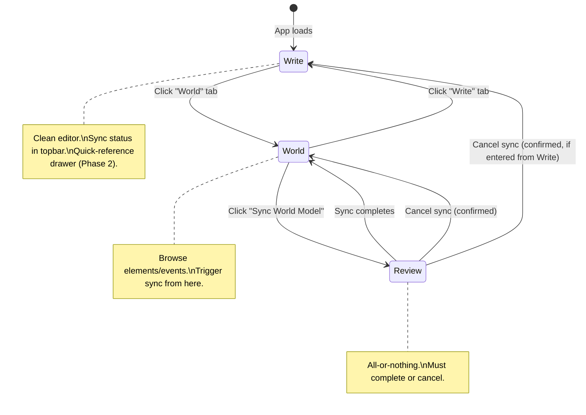

**The toggle lives at the top of the sidebar** as two tab buttons: **Write** and **World**. This is subtle, integrates with the existing sidebar design, and doesn't add a new top-level chrome bar. The toggle is always visible in Write and World modes but hidden during Review mode (to prevent accidental mode switches mid-sync).

**Review mode is modal** — once entered, the writer must complete the sync or explicitly cancel (with a confirmation dialog). This prevents partial world model state and keeps the mental model simple: "sync is a committed action."

### 4.2 Write Mode (Current + Additions)

The current editor experience is preserved exactly as-is. Two small additions:

**Sync status indicator in the topbar:**

A subtle badge next to the existing status pill:

```
┌─────────────────────────────────────────────────────────────┐
│  File > story-structure > opening-scene.story               │
│  Opening scene                                     [Autosaved locally]
│  Editing the browser-saved copy.                   [World: 3 unsynced]
│                                                             │
│  ┌─────────────────────────────────────────────────────┐   │
│  │  (Tiptap editor, unchanged)                         │   │
│  │                                                     │   │
│  └─────────────────────────────────────────────────────┘   │
└─────────────────────────────────────────────────────────────┘
```

- When synced: `World: synced` (green, muted)
- When unsynced: `World: 3 unsynced` (amber)
- When no world model: `World: not initialized` (gray)
- Clicking the badge switches to World mode

**Quick-reference drawer (Phase 2):**

A button in the topbar (or keyboard shortcut) opens a right-side drawer without leaving Write mode. The drawer shows:
- A search input at the top
- A list of elements and events matching the search
- Clicking one shows its Core Understanding and key sections in a condensed view
- A close button or click-outside dismisses the drawer

The editor and sidebar remain fully visible and functional. The drawer overlays on top of the main panel, narrowing the visible editor area slightly.

This is scoped as Phase 2 — not in the initial implementation.

### 4.3 World Mode

When the writer clicks the "World" tab, the entire UI transforms. The sidebar shows the world model browser and the main panel shows detail views.

#### 4.3.1 World Mode Sidebar

```
┌──────────────────────────────┐
│  [Write]  [World]            │  ← mode tabs (World is active)
│──────────────────────────────│
│  ┌────────────────────────┐  │
│  │  Sync World Model      │  │  ← primary CTA button
│  └────────────────────────┘  │
│  ● Synced                    │  ← or "● 3 files unsynced" (amber)
│  Last sync: 2h ago           │
│──────────────────────────────│
│  🔍 Search elements/events   │  ← search/filter input
│──────────────────────────────│
│  PEOPLE (4)              ▾   │  ← collapsible kind group
│    ● Mira                    │  ← filled detail = solid dot
│    ● Arun                    │
│    ○ Elias                   │  ← TBD detail = hollow dot
│    ○ Sister Celine           │
│──────────────────────────────│
│  PLACES (1)              ▾   │
│    ○ Saint Alder Chapel      │
│──────────────────────────────│
│  ITEMS (4)               ▾   │
│    ● Silver Key              │
│    ○ Toll House Ledger Page  │
│    ○ Cloth Bundle            │
│    ○ Cracked Watch           │
│──────────────────────────────│
│  EVENTS                      │
│  Ch 7 — Late June 1998  ▾   │  ← events grouped by chapter
│    ● Mira receives letter    │
│    ● Discovery of silver key │
│  Ch 8 — June 28, 1998   ▾   │
│    ○ Cloth bundle at altar   │
│    ○ Celine reveals key...   │
│    ○ ...                     │
└──────────────────────────────┘
```

**Design details:**
- Kind groups are collapsible. Elements are sorted alphabetically within each group.
- Events are grouped by chapter (extracted from the `chapters` field in the index). Within a chapter, sorted by `when` field.
- The solid/hollow dot indicates whether the detail file has content beyond TBD.
- Search filters both elements and events by name/summary. As the user types, non-matching entries are hidden.
- The "Sync World Model" button is disabled if `syncState.status === 'synced'` or `'never_synced'` with no content written. Enabled when unsynced.
- When no world model exists: the sidebar shows a message: "No world model yet. Write some story content and sync to build your world."

#### 4.3.2 World Mode Main Panel — Overview Dashboard

When no specific element/event is selected (or on first entering World mode):

```
┌────────────────────────────────────────────────────────────┐
│  WORLD MODEL                                               │
│  My Saga                                                   │
│────────────────────────────────────────────────────────────│
│                                                            │
│  ┌──────────┐  ┌──────────┐  ┌───────────────────────┐   │
│  │    9     │  │    7     │  │  Last synced:          │   │
│  │ Elements │  │ Events   │  │  Mar 25, 2026 2:30 PM │   │
│  └──────────┘  └──────────┘  └───────────────────────┘   │
│                                                            │
│  ● 3 files changed since last sync                        │
│  ┌────────────────────────┐                               │
│  │  Sync World Model      │                               │
│  └────────────────────────┘                               │
│                                                            │
│  Element breakdown:                                        │
│  4 people  ·  1 place  ·  4 items                         │
│  5 of 9 details populated                                  │
│                                                            │
│  Event breakdown:                                          │
│  2 chapters covered  ·  7 events tracked                  │
│  2 of 7 details populated                                  │
│                                                            │
│  ─────────────────────────────────────────                │
│                                                            │
│  Recently updated:                                         │
│  ┌─ Mira (person) ─────────────────────────────────┐     │
│  │  Determined young woman who arrives at Saint     │     │
│  │  Alder Chapel following cryptic instructions...  │     │
│  └──────────────────────────────────────────────────┘     │
│  ┌─ Mira receives letter (event, Ch 7) ────────────┐     │
│  │  Mira receives an unexpected letter from her     │     │
│  │  mother containing a silver key and three words. │     │
│  └──────────────────────────────────────────────────┘     │
│                                                            │
└────────────────────────────────────────────────────────────┘
```

**When no world model exists:**

```
┌────────────────────────────────────────────────────────────┐
│  WORLD MODEL                                               │
│  My Saga                                                   │
│────────────────────────────────────────────────────────────│
│                                                            │
│  No world model yet.                                       │
│                                                            │
│  Write your story in the editor, then come back here       │
│  and click "Sync World Model" to have the AI identify      │
│  your characters, places, items, and events.               │
│                                                            │
│  The world model builds incrementally — sync whenever      │
│  you've made meaningful changes to your story.             │
│                                                            │
└────────────────────────────────────────────────────────────┘
```

#### 4.3.3 World Mode Main Panel — Element Detail

When the writer clicks an element in the sidebar:

```
┌────────────────────────────────────────────────────────────┐
│  PERSON                                                    │
│  Mira                                                      │
│  aka: Mira Vale  ·  elt_45d617e4531b                      │
│  Keys: carries the silver key; chapel visitor              │
│────────────────────────────────────────────────────────────│
│                                                            │
│  ▼ Core Understanding                                      │
│  ┌──────────────────────────────────────────────────────┐ │
│  │ Mira is a determined young woman who arrives at      │ │
│  │ Saint Alder Chapel at 11:40 PM, following cryptic    │ │
│  │ instructions from her mother. She carries a silver   │ │
│  │ key and a letter containing three words: "Close it." │ │
│  └──────────────────────────────────────────────────────┘ │
│                                                            │
│  ▼ Stable Profile                                          │
│  • Mid-twenties, dark hair                                 │
│  • Carries a silver key inherited from mother              │
│  • Arrival at the chapel is recent                         │
│  • Shows resourcefulness under pressure                    │
│                                                            │
│  ▼ Interpretation                                          │
│  • Her relationship with her mother is complicated —       │
│    the letter suggests urgency and secrecy                 │
│  • The instruction "Close it" implies she's expected       │
│    to act, not just investigate                            │
│                                                            │
│  ▼ Knowledge / Beliefs / Uncertainties                     │
│  • Believes the key opens something in the chapel          │
│  • Uncertain about Sister Celine's true motives            │
│  • Does not know the chapel's full history                 │
│                                                            │
│  ▼ Element-Centered Chronology                             │
│  ┌ Before current narrative ────────────────────────┐     │
│  │ • Grew up hearing stories about the chapel       │     │
│  │ • Had limited contact with mother in recent years │     │
│  └──────────────────────────────────────────────────┘     │
│  ┌ Chapter 7 — Late June 1998 ──────────────────────┐     │
│  │ • Receives letter with key                        │     │
│  │ • Arrives at Saint Alder Chapel at 11:40 PM       │     │
│  └──────────────────────────────────────────────────┘     │
│  ┌ Chapter 8 — June 28, 1998 ───────────────────────┐     │
│  │ • Discovers cloth bundle at altar                 │     │
│  │ • Encounters Sister Celine in the nave            │     │
│  └──────────────────────────────────────────────────┘     │
│                                                            │
│  ▼ Open Threads                                            │
│  • What does the key actually open?                        │
│  • Why did her mother send it now?                         │
│  • What is the connection between the cloth bundle         │
│    and the key?                                            │
│                                                            │
└────────────────────────────────────────────────────────────┘
```

**Design details:**
- Sections are rendered as an accordion — all expanded by default, collapsible.
- The header shows: kind badge, canonical name, aliases, UUID (muted), identification keys.
- Bullet lists are rendered as styled unordered lists.
- Chronology sub-sections (per chapter/era) are rendered as nested cards within the Chronology accordion.
- Sections with only `"- TBD"` content show: *"Not yet populated. Run a sync to fill this in."* in muted text.

#### 4.3.4 World Mode Main Panel — Event Detail

Similar structure to element detail but with event-specific sections:

```
┌────────────────────────────────────────────────────────────┐
│  EVENT                                                     │
│  Mira receives mother's letter                             │
│  When: Late June 1998  ·  Chapters: 7  ·  evt_f72bc8fe0f29│
│────────────────────────────────────────────────────────────│
│                                                            │
│  ▼ Core Understanding                                      │
│  ┌──────────────────────────────────────────────────────┐ │
│  │ Mira receives an unexpected letter from her mother   │ │
│  │ containing a tarnished silver key and three words:   │ │
│  │ "Close it." This sets the entire plot in motion.     │ │
│  └──────────────────────────────────────────────────────┘ │
│                                                            │
│  ▼ Causal Context                                          │
│  • Mother's declining health prompted the letter           │
│  • The key has been in the family for generations          │
│                                                            │
│  ▼ Consequences & Ripple Effects                           │
│  • Mira decides to visit Saint Alder Chapel                │
│  • Sets the main plot in motion                            │
│  • Creates tension with Mira's unresolved feelings         │
│    about her mother                                        │
│                                                            │
│  ▼ Participants & Roles                                    │
│  • Mira (recipient, protagonist)                           │
│  • Mother (sender, off-screen catalyst)                    │
│                                                            │
│  ▼ Evidence & Grounding                                    │
│  • "She unfolded the letter carefully, as if it might      │
│    crumble" — Chapter 7                                    │
│  • "Inside was a silver key, tarnished with age"           │
│                                                            │
│  ▼ Open Threads                                            │
│  • Full contents of the letter not yet revealed            │
│  • Mother's current status unknown                         │
│                                                            │
└────────────────────────────────────────────────────────────┘
```

### 4.4 Sync Review Mode

This is the most complex UI state. The writer enters Review mode by clicking "Sync World Model" in World mode. The UI transforms into a focused wizard that guides them through the pipeline.

#### 4.4.1 Review Mode Layout

```
┌──────────────────────────────┬─────────────────────────────────────────┐
│  SYNC PROGRESS               │                                         │
│──────────────────────────────│  (Main panel: current review step)      │
│                              │                                         │
│  ✓ Select Changes            │                                         │
│  ● Events Index              │  ← current step (highlighted)           │
│  ○ Elements Index            │                                         │
│  ○ Element Details (0/9)     │                                         │
│  ○ Event Details (0/7)       │                                         │
│  ○ Complete                  │                                         │
│                              │                                         │
│──────────────────────────────│                                         │
│                              │                                         │
│  [Cancel Sync]               │                                         │
│                              │                                         │
│  Canceling discards all      │                                         │
│  sync progress.              │                                         │
│                              │                                         │
└──────────────────────────────┴─────────────────────────────────────────┘
```

The sidebar shows a vertical stepper (using Mantine's `Stepper` component). Steps update as the writer progresses: ✓ = completed, ● = active, ○ = pending. The detail steps show a counter (e.g., "3/9") that updates as pages are approved.

"Cancel Sync" is always visible with a warning note. Clicking it shows a confirmation dialog.

#### 4.4.2 Step 0 — Diff Preview & File Selection

The first step shows the writer what has changed in their story since the last sync, with file-level checkboxes:

```
┌────────────────────────────────────────────────────────────┐
│  Select Changes to Sync                                    │
│────────────────────────────────────────────────────────────│
│                                                            │
│  These story files have changed since your last sync.      │
│  Select which files to include in this world model update. │
│                                                            │
│  ┌──────────────────────────────────────────────────────┐ │
│  │ ☑ chapter-07.story                          modified │ │
│  │──────────────────────────────────────────────────────│ │
│  │   @@ changes @@                                      │ │
│  │     The rain had stopped by the time she              │ │
│  │   - walked to the chapel.                             │ │
│  │   + walked to Saint Alder Chapel. The clock           │ │
│  │   + on the bell tower read 11:40 PM as she            │ │
│  │   + pushed through the heavy oak doors.               │ │
│  │   ...                                                 │ │
│  │   [Show full diff ▾]                                  │ │
│  └──────────────────────────────────────────────────────┘ │
│                                                            │
│  ┌──────────────────────────────────────────────────────┐ │
│  │ ☑ chapter-08.story                          modified │ │
│  │──────────────────────────────────────────────────────│ │
│  │   @@ changes @@                                      │ │
│  │   + June 28, 1998 — 07:15                             │ │
│  │   + She noticed a bundle wrapped in stained cloth     │ │
│  │   + resting against the base of the altar.            │ │
│  │   ...                                                 │ │
│  │   [Show full diff ▾]                                  │ │
│  └──────────────────────────────────────────────────────┘ │
│                                                            │
│  ┌──────────────────────────────────────────────────────┐ │
│  │ ☐ notes-draft.story                         modified │ │
│  │──────────────────────────────────────────────────────│ │
│  │   (diff preview collapsed when unchecked)            │ │
│  └──────────────────────────────────────────────────────┘ │
│                                                            │
│  2 of 3 files selected                                     │
│                                                            │
│                              [Cancel]      [Continue →]    │
└────────────────────────────────────────────────────────────┘
```

**Design details:**
- Each file is a card with a checkbox, filename, and change status (modified / added / deleted).
- Diff preview is shown inline, collapsed by default, expandable per file.
- Diff lines use standard coloring: green background for additions, red for removals, neutral for context.
- Files are checked by default. Unchecking excludes them from the sync.
- "Continue" is disabled if no files are selected.
- The combined diff from selected files is what gets sent to the harness.

#### 4.4.3 Steps 1 & 2 — Index Review (Events / Elements)

Both index review steps share the same layout. The main panel shows the AI's proposal as a list of structured cards:

```
┌────────────────────────────────────────────────────────────┐
│  Events Index — Proposal                        Attempt #1 │
│────────────────────────────────────────────────────────────│
│                                                            │
│  AI scan summary:                                          │
│  ┌──────────────────────────────────────────────────────┐ │
│  │ "The diff enriches Chapters 7-8 with precise        │ │
│  │ timestamps, adds two new scenes (cloth bundle        │ │
│  │ discovery, Celine's revelation), and deepens the     │ │
│  │ letter-receiving event with physical details."       │ │
│  └──────────────────────────────────────────────────────┘ │
│                                                            │
│  Proposed changes (3):                                     │
│                                                            │
│  ┌ + CREATE ────────────────────────────────────────────┐ │
│  │  When: June 28, 1998, 07:15                          │ │
│  │  Chapters: 8                                         │ │
│  │  Summary: Mira discovers cloth bundle at the         │ │
│  │           chapel altar                                │ │
│  │                                                      │ │
│  │  Reason: New scene added in chapter 8 diff           │ │
│  │  Evidence:                                           │ │
│  │    • "+ She noticed a bundle wrapped in stained..."  │ │
│  │    • "+ resting against the base of the altar."      │ │
│  └──────────────────────────────────────────────────────┘ │
│                                                            │
│  ┌ ✎ UPDATE evt_f72bc8fe0f29 ──────────────────────────┐ │
│  │  Summary: Mira receives mother's letter              │ │
│  │           → Mira receives mother's letter at the     │ │
│  │             toll house, 11:40 PM                      │ │
│  │                                                      │ │
│  │  Reason: Diff adds precise timestamp and location    │ │
│  │  Evidence:                                           │ │
│  │    • "+ clock on the bell tower read 11:40 PM"       │ │
│  └──────────────────────────────────────────────────────┘ │
│                                                            │
│  ┌ ✎ UPDATE evt_50b5adf351ae ──────────────────────────┐ │
│  │  Summary: Silver key discovery                       │ │
│  │           → (unchanged)                              │ │
│  │                                                      │ │
│  │  Reason: Diff adds physical description of the key   │ │
│  │  Evidence:                                           │ │
│  │    • "+ tarnished with age, and three words"          │ │
│  └──────────────────────────────────────────────────────┘ │
│                                                            │
│  ─────────────────────────────────────────────            │
│                                                            │
│  Feedback:                                                 │
│  ┌──────────────────────────────────────────────────────┐ │
│  │                                                      │ │
│  │  (optional — provide notes if requesting changes)    │ │
│  │                                                      │ │
│  └──────────────────────────────────────────────────────┘ │
│                                                            │
│               [Request Changes]          [Approve →]       │
└────────────────────────────────────────────────────────────┘
```

**Elements index review** follows the same layout, with element-specific fields:

```
  ┌ + NEW ─────────────────────────────────────────────────┐
  │  Cloth Bundle (item)                                    │
  │  Aliases: cloth bundle, stained bundle                  │
  │  Keys: found at altar; stained fabric                   │
  │                                                        │
  │  Snapshot: A bundle of stained cloth discovered         │
  │  at the altar of Saint Alder Chapel. Its contents       │
  │  and origin are unknown.                                │
  │                                                        │
  │  Evidence:                                              │
  │    • "+ a bundle wrapped in stained cloth"              │
  └────────────────────────────────────────────────────────┘

  ┌ ✎ EXISTING — Mira (person) ────────────────────────────┐
  │  UUID: elt_45d617e4531b                                 │
  │  Update instruction: Add chronology entry for           │
  │  cloth bundle discovery. Update Core Understanding      │
  │  with 11:40 PM timestamp.                               │
  │                                                        │
  │  Evidence:                                              │
  │    • "+ pushed through the heavy oak doors"             │
  │    • "+ She noticed a bundle"                           │
  └────────────────────────────────────────────────────────┘
```

**Interaction:**
- "Approve →" applies the proposal and advances to the next step.
- "Request Changes" requires non-empty feedback text. Sends feedback to backend, which re-calls the LLM. The UI shows a loading state, then renders the new proposal with "Attempt #2" in the header.
- The writer can see this is a revision and compare mentally with the previous attempt.

#### 4.4.4 Steps 3 & 4 — Detail Review (Elements / Events)

Detail pages are reviewed one at a time. The main panel shows the proposed changes as a unified diff of the detail markdown file:

```
┌────────────────────────────────────────────────────────────┐
│  Element Detail — Mira                        3 of 9       │
│  elt_45d617e4531b                             Attempt #1   │
│────────────────────────────────────────────────────────────│
│                                                            │
│  AI rationale:                                             │
│  ┌──────────────────────────────────────────────────────┐ │
│  │ "Added chronology entry for Chapter 8 cloth bundle   │ │
│  │ discovery. Updated Core Understanding to reflect     │ │
│  │ precise arrival time. Added open thread about the    │ │
│  │ connection between bundle and key."                  │ │
│  └──────────────────────────────────────────────────────┘ │
│                                                            │
│  Proposed diff:                                            │
│  ┌──────────────────────────────────────────────────────┐ │
│  │ --- a/elements/elt_45d617e4531b.md                   │ │
│  │ +++ b/elements/elt_45d617e4531b.md                   │ │
│  │                                                      │ │
│  │  ## Core Understanding                               │ │
│  │ -Mira is a determined young woman who arrives        │ │
│  │ -at the chapel.                                      │ │
│  │ +Mira is a determined young woman who arrives        │ │
│  │ +at Saint Alder Chapel at 11:40 PM, carrying a      │ │
│  │ +silver key and a letter with three words:           │ │
│  │ +"Close it."                                         │ │
│  │                                                      │ │
│  │  ## Element-Centered Chronology                      │ │
│  │  ### Chapter 8 — June 28, 1998                       │ │
│  │ +- Discovers cloth bundle at altar                   │ │
│  │ +- Bundle contains stained fabric and unknown        │ │
│  │ +  contents                                          │ │
│  │                                                      │ │
│  │  ## Open Threads                                     │ │
│  │ +- What is the connection between the cloth          │ │
│  │ +  bundle and the silver key?                        │ │
│  └──────────────────────────────────────────────────────┘ │
│                                                            │
│  Feedback:                                                 │
│  ┌──────────────────────────────────────────────────────┐ │
│  │                                                      │ │
│  └──────────────────────────────────────────────────────┘ │
│                                                            │
│     [Skip]     [Request Changes]          [Approve →]      │
└────────────────────────────────────────────────────────────┘
```

**Design details:**
- The diff is rendered with standard coloring: green for additions, red for removals, gray for context.
- "3 of 9" counter updates as the writer progresses through detail pages.
- "Skip" skips this element/event without applying changes — useful when the writer wants to leave some details for a future sync.
- "Approve →" stores the updated markdown and advances to the next target.
- "Request Changes" works the same as index review — feedback textarea + re-call.
- When all detail pages for a layer are done (or skipped), the stepper advances to the next step.

#### 4.4.5 Step 5 — Sync Complete

```
┌────────────────────────────────────────────────────────────┐
│  Sync Complete                                             │
│────────────────────────────────────────────────────────────│
│                                                            │
│  Your world model has been updated.                        │
│                                                            │
│  Events:                                                   │
│  • 1 created, 2 updated, 0 deleted                        │
│                                                            │
│  Elements:                                                 │
│  • 1 new element identified                                │
│  • 5 detail pages updated, 4 skipped                      │
│                                                            │
│  Event details:                                            │
│  • 3 detail pages updated, 4 skipped                      │
│                                                            │
│  Synced at: March 25, 2026 2:30 PM                        │
│                                                            │
│               [Return to World View]                       │
└────────────────────────────────────────────────────────────┘
```

Clicking "Return to World View" switches to World mode, where the writer can browse the updated world model.

#### 4.4.6 Cancel Sync Confirmation

When the writer clicks "Cancel Sync" at any point during review:

```
┌────────────────────────────────────────────────┐
│  Cancel Sync?                                  │
│                                                │
│  This will discard all sync progress.          │
│  No changes will be applied to the world       │
│  model. You can start a new sync at any time.  │
│                                                │
│  Events index:    approved (will be discarded) │
│  Elements index:  approved (will be discarded) │
│  Element details: 3 of 9 approved (discarded)  │
│  Event details:   not started                  │
│                                                │
│           [Continue Sync]    [Discard & Exit]  │
└────────────────────────────────────────────────┘
```

The dialog shows what would be lost. "Continue Sync" returns to the current step. "Discard & Exit" returns to World mode with no changes applied.

### 4.5 Download Warning Flow

When the writer clicks "Download" in the Project menu while `syncState.status === 'unsynced'`:

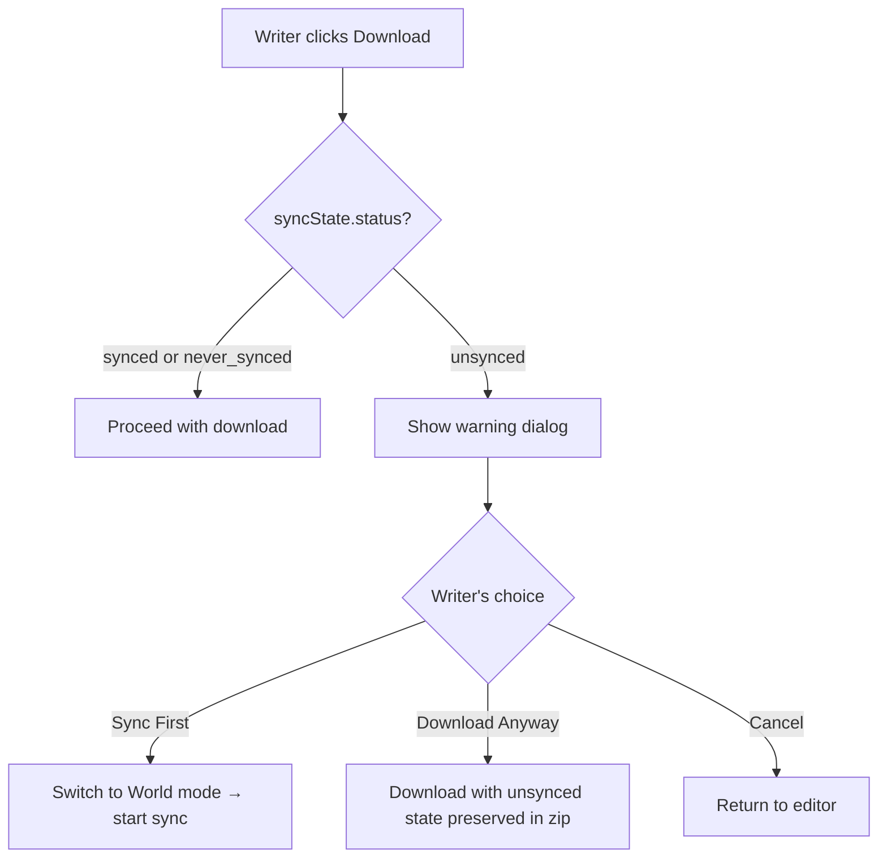

**Warning dialog:**

```
┌─────────────────────────────────────────────────────┐
│  World Model Out of Sync                            │
│                                                     │
│  Your world model hasn't been synced with recent    │
│  story changes. 3 files have changed since the      │
│  last sync.                                         │
│                                                     │
│  If you download now, the zip will include the      │
│  current world model and a record of unsynced       │
│  changes, so you can sync after reloading.          │
│                                                     │
│  [Cancel]   [Download Anyway]   [Sync First]        │
└─────────────────────────────────────────────────────┘
```

---

## 5. Data Architecture

### 5.1 Complete State Model

The application manages four distinct state objects. Two are persisted to `localStorage` (and included in zip exports). Two are transient.

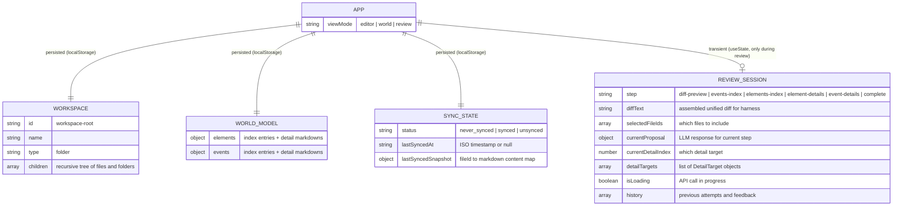

| State | Storage | In Zip | Survives Refresh |
|-------|---------|--------|------------------|
| `workspace` | `useLocalStorage` | Yes | Yes |
| `worldModel` | `useLocalStorage` | Yes | Yes |
| `syncState` | `useLocalStorage` | Yes | Yes |
| `viewMode` | `useState` | No | No (resets to 'editor') |
| `reviewSession` | `useState` | No | No (all-or-nothing, discarded on exit) |

### 5.2 World Model Data Schema

The world model is stored as a JSON object in the browser. The markdown format (used by the notebook and stored in the zip) is a serialization of this JSON.

```js
worldModel: {
  // --- Elements Layer ---
  elements: {
    // The preamble text from elements.md (everything before ## Entries)
    indexPreamble: "# Elements\n\nPurpose:\nThis file is the canonical index...",

    // Parsed index entries
    entries: [
      {
        kind: "person",           // person|place|item|animal|relationship|concept|group|other
        display_name: "Mira",
        uuid: "elt_45d617e4531b",
        aliases: "Mira Vale",     // comma-separated string
        identification_keys: "carries the silver key; chapel visitor"  // semicolon-separated
      },
      // ...
    ],

    // Detail file content, keyed by UUID
    // Value is the raw markdown string of the detail file
    details: {
      "elt_45d617e4531b": "# Mira\n\n## Identification\n- UUID: elt_45d617e4531b\n...",
      "elt_03e8d4548117": "# Saint Alder Chapel\n\n## Identification\n...",
      // ...
    }
  },

  // --- Events Layer ---
  events: {
    indexPreamble: "# Events\n\nPurpose:\nThis file is the canonical index...",

    entries: [
      {
        uuid: "evt_f72bc8fe0f29",
        when: "Late June 1998",
        chapters: "Chapter 7",
        summary: "Mira receives a letter from her mother"
      },
      // ...
    ],

    details: {
      "evt_f72bc8fe0f29": "# Mira receives a letter...\n\n## Identification\n...",
      // ...
    }
  }
}
```

**Key design decisions:**
- Detail files are stored as **raw markdown strings**, not parsed JSON. This avoids maintaining two representations and makes round-tripping with the markdown format trivial. The frontend renders the markdown for display; the backend parses it when needed for the harness.
- The index preamble is preserved verbatim. It contains the definitions and format specification that the LLM agents rely on. Editing it would break the harness prompts.
- An empty/uninitialized world model is `null`. The first sync creates the full structure.

**Serialization to markdown (for zip and backend):**

| JSON field | Markdown file |
|------------|---------------|
| `elements.indexPreamble` + `elements.entries` | `world-model/elements.md` |
| `elements.details["elt_xxx"]` | `world-model/elements/elt_xxx.md` |
| `events.indexPreamble` + `events.entries` | `world-model/events.md` |
| `events.details["evt_xxx"]` | `world-model/events/evt_xxx.md` |

The index markdown is assembled by joining the preamble with a rendered `## Entries` section where each entry is a pipe-delimited line.

### 5.3 Change Detection & Diff Computation

The system tracks what story content has been synced by storing a **snapshot** of all file content at sync time. Changes are detected by comparing the current workspace against this snapshot.

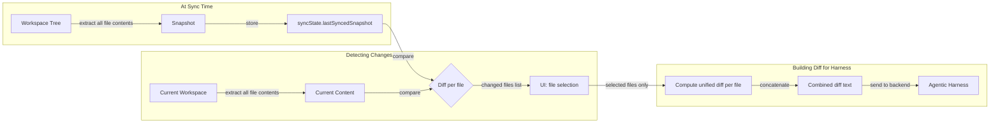

**Content transformation pipeline:**

1. **Extract**: Walk the workspace tree, collect all file nodes → `{ fileId: htmlContent }`
2. **Convert**: For each file, convert Tiptap HTML → Markdown using the `turndown` library. This produces clean, diffable text.
3. **Snapshot comparison**: Compare current markdown for each file against `lastSyncedSnapshot[fileId]` (which also stores markdown).
4. **Detect changes**: Files with different markdown = changed. Files in current but not snapshot = added. Files in snapshot but not current = deleted.
5. **Compute diff**: For each changed file, use `jsdiff`'s `structuredPatch()` to compute a unified diff.
6. **File selection**: Writer checks/unchecks files in the UI.
7. **Assemble**: Concatenate the unified diffs of selected files into a single diff string. This string is what gets sent to the harness.

**Example of assembled diff sent to harness:**

```diff
--- a/story-structure/chapter-07.story
+++ b/story-structure/chapter-07.story
@@ -5,3 +5,7 @@
 The rain had stopped by the time she
-walked to the chapel.
+walked to Saint Alder Chapel. The clock
+on the bell tower read 11:40 PM as she
+pushed through the heavy oak doors.

--- a/story-structure/chapter-08.story
+++ b/story-structure/chapter-08.story
@@ -1,5 +1,12 @@
+June 28, 1998 — 07:15
+
+She noticed a bundle wrapped in stained cloth
+resting against the base of the altar.
```

**Updating the snapshot after sync:**

After a sync completes successfully, `lastSyncedSnapshot` is updated. But only for the files that were included in the sync. Files that were excluded remain in their previous snapshot state (or absent if new), so they'll still show as "changed" in the next sync.

```js
// After successful sync:
const updatedSnapshot = { ...syncState.lastSyncedSnapshot }
for (const fileId of selectedFileIds) {
  const file = findNodeMeta(workspace, fileId)
  if (file) {
    updatedSnapshot[fileId] = convertHtmlToMarkdown(file.node.content)
  }
}
// Also remove entries for deleted files
for (const fileId of Object.keys(updatedSnapshot)) {
  if (!findNodeMeta(workspace, fileId)) {
    delete updatedSnapshot[fileId]
  }
}
syncState.lastSyncedSnapshot = updatedSnapshot
syncState.lastSyncedAt = new Date().toISOString()
syncState.status = 'synced' // or recalculate if excluded files still differ
```

### 5.4 Persistence

#### 5.4.1 localStorage Layout

| Key | Contents |
|-----|----------|
| `editor-app-workspace-v1` | Workspace tree (existing, unchanged) |
| `editor-app-world-model-v1` | World model JSON (`null` if not initialized) |
| `editor-app-sync-state-v1` | Sync state JSON (`{ status: 'never_synced', lastSyncedAt: null, lastSyncedSnapshot: {} }`) |

These are separate keys (not combined) to avoid overwriting the workspace on every world model change and vice versa.

#### 5.4.2 Zip Archive Format v2

The archive format is extended to include the world model and sync state. The version number is bumped from 1 to 2.

```
project.zip
├── workspace.json                    # Main payload (structured state)
└── world-model/                      # Raw markdown files (portable)
    ├── elements.md                   # Rendered from worldModel.elements
    ├── elements/
    │   ├── elt_45d617e4531b.md
    │   ├── elt_03e8d4548117.md
    │   └── ...
    ├── events.md                     # Rendered from worldModel.events
    └── events/
        ├── evt_f72bc8fe0f29.md
        └── ...
```

**`workspace.json` payload (v2):**

```json
{
  "app": "editor-app",
  "version": 2,
  "exportedAt": "2026-03-25T14:30:00.000Z",
  "workspace": { "id": "workspace-root", "name": "workspace", "type": "folder", "children": [] },
  "selectedNodeId": "opening-scene",
  "worldModel": {
    "elements": {
      "indexPreamble": "...",
      "entries": [],
      "details": {}
    },
    "events": {
      "indexPreamble": "...",
      "entries": [],
      "details": {}
    }
  },
  "syncState": {
    "status": "unsynced",
    "lastSyncedAt": "2026-03-25T12:00:00.000Z",
    "lastSyncedSnapshot": {
      "file-id-1": "# Chapter 7\n\nThe rain had stopped...",
      "file-id-2": "# Chapter 8\n\nJune 28, 1998..."
    }
  }
}
```

**Why both `workspace.json` and `world-model/` directory?**

- `workspace.json` is the structured state the app reads on import. It's the source of truth for the frontend.
- The `world-model/` directory contains the same data as raw markdown files. This makes the zip **portable** — the notebook can read these files directly, and a human can open them in any text editor. It's a convenience copy, not a second source of truth.

#### 5.4.3 Backward Compatibility

| Zip Version | World Model | Sync State | Import Behavior |
|-------------|-------------|------------|-----------------|
| v1 | Not present | Not present | Workspace restored. World model set to `null`. Sync state set to `'never_synced'`. |
| v2 | Present | Present | Full restore of workspace + world model + sync state. |
| v2, `worldModel: null` | Null (never synced) | `'never_synced'` | Workspace restored. No world model. |

The import validation function checks `payload.version`:
- `version === 1`: Extract `workspace` and `selectedNodeId` only (current behavior).
- `version === 2`: Also extract `worldModel` and `syncState`.
- Unknown version: Reject with error.

---

## 6. Agentic Harness Integration

### 6.1 Pipeline Overview

The full sync pipeline consists of four stages, each with human-in-the-loop review. The stages must run in order because later stages depend on earlier results.

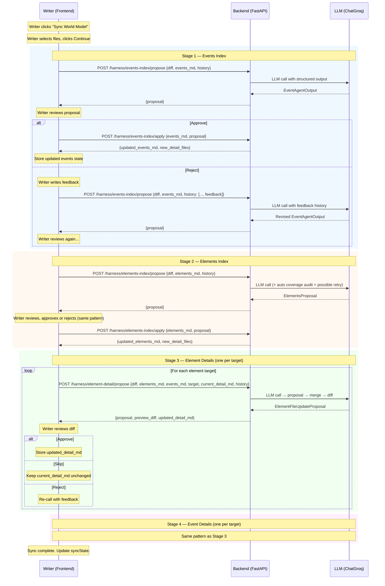

### 6.2 Frontend ↔ Backend Data Flow

The frontend owns all state. The backend is a **stateless compute layer** — it receives inputs, calls the LLM, and returns results. No session state is maintained on the backend between requests.

**What the frontend sends at each step:**

| Step | Endpoint | Key Inputs |
|------|----------|------------|
| Events Index Propose | `POST /harness/events-index/propose` | `diff_text`, `events_md` (rendered from worldModel), `history` (feedback from prior rejections) |
| Events Index Apply | `POST /harness/events-index/apply` | `events_md`, `proposal` (the approved EventAgentOutput JSON) |
| Elements Index Propose | `POST /harness/elements-index/propose` | `diff_text`, `elements_md`, `history` |
| Elements Index Apply | `POST /harness/elements-index/apply` | `elements_md`, `proposal` (the approved ElementsProposal JSON) |
| Element Detail Propose | `POST /harness/element-detail/propose` | `diff_text`, `elements_md`, `events_md`, `target` (uuid, display_name, kind, delta_action, update_context), `current_detail_md`, `history` |
| Event Detail Propose | `POST /harness/event-detail/propose` | `diff_text`, `events_md`, `target`, `current_detail_md`, `history` |

**What the backend returns:**

| Step | Key Outputs |
|------|-------------|
| Events Index Propose | `proposal`: the `EventAgentOutput` JSON (deltas with action/uuid/when/chapters/summary/reason/evidence) |
| Events Index Apply | `events_md`: updated index markdown. `detail_files`: `{ uuid: markdown }` for newly created event detail files. `actions`: human-readable list of what was done. |
| Elements Index Propose | `proposal`: the `ElementsProposal` JSON |
| Elements Index Apply | `elements_md`: updated index markdown. `detail_files`: `{ uuid: markdown }` for new element detail files. `actions`: list. |
| Element Detail Propose | `proposal`: the `ElementFileUpdateProposal` JSON. `preview_diff`: unified diff string. `updated_detail_md`: the new markdown if approved. |
| Event Detail Propose | Same pattern as element detail. |

**How the frontend stores results after approval:**

- **Index apply**: Update `worldModel.events.entries` (re-parsed from `events_md`), update `worldModel.events.indexPreamble`, merge `detail_files` into `worldModel.events.details`. Same for elements.
- **Detail approve**: Store `updated_detail_md` in `worldModel.elements.details[uuid]` (or events).
- **Detail skip**: No change to the detail markdown.

### 6.3 Content Transformation Pipeline

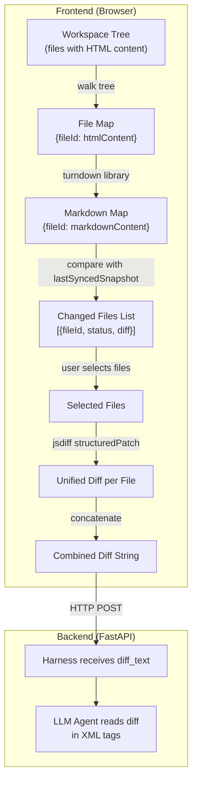

**HTML → Markdown conversion details:**

The `turndown` library converts Tiptap HTML to clean markdown:

| HTML Input | Markdown Output |
|------------|-----------------|
| `<h1>Opening scene</h1>` | `# Opening scene` |
| `<p>Start close to the character.</p>` | `Start close to the character.` |
| `<ul><li>Hook the reader.</li></ul>` | `- Hook the reader.` |
| `<strong>Beginning:</strong> guarded.` | `**Beginning:** guarded.` |
| `<blockquote><p>A quote.</p></blockquote>` | `> A quote.` |

This produces the same kind of markdown that the notebook's manuscript files contain, making the diffs directly usable by the harness prompts.

### 6.4 Proposal Application (Index Steps)

After the writer approves an index proposal, the frontend sends it to the `/apply` endpoint. The backend uses the existing `BaseLayerAccessor` and `apply_proposal()` logic:

**Events Index Apply:**
1. Write the received `events_md` to a temp directory as `events.md`
2. Initialize `BaseLayerAccessor` with the temp directory
3. Call `EventIndexAgent.apply_proposal(proposal)` which iterates over deltas:
   - CREATE → `accessor.apply_create()` → generates UUID, writes detail template
   - UPDATE → `accessor.apply_update()` → modifies index entry
   - DELETE → `accessor.apply_delete()` → removes entry + detail file
4. Read back the updated `events.md` and all detail files from the temp directory
5. Return to frontend

**Elements Index Apply:**
1. Same pattern, but uses the `ElementIndexAgent.apply_proposal()` which includes the deterministic fuzzy-matching resolution layer
2. New elements get UUIDs auto-generated by the accessor
3. Existing elements get aliases and identification_keys merged (deduplication)

**Why not do this in the frontend?**
The apply logic for elements includes fuzzy matching (normalized name/alias/key comparison), alias merging with deduplication, and the accessor's validate/repair mechanisms. Keeping this in Python reuses the tested notebook code without porting complex logic to JS.

### 6.5 Proposal Application (Detail Steps)

For detail pages, the backend's `/propose` endpoint already returns the `updated_detail_md` — the merged result of applying the proposal to the current markdown. The frontend doesn't need a separate `/apply` call.

The merge pipeline (all happening in the backend `/propose` call):

1. Parse `current_detail_md` into a structured object (`ParsedElementFile` or `ParsedEventFile`)
2. Call the LLM → get the proposal (`ElementFileUpdateProposal` or `EventFileUpdateProposal`)
3. Apply the proposal to the parsed object:
   - `core_understanding_replacement` → full replacement of the section
   - `*_to_add` / `*_to_remove` → additive/subtractive merge of bullet-list sections (deduplication by normalized text)
   - `chronology_blocks_to_add` → merge by heading, deduplicate entries within each block
4. Render the merged object back to markdown → `updated_detail_md`
5. Compute unified diff between `current_detail_md` and `updated_detail_md` → `preview_diff`
6. Return all three to the frontend

When the writer approves: the frontend stores `updated_detail_md` in `worldModel.*.details[uuid]`.
When the writer skips: the frontend keeps the original `current_detail_md` unchanged.
When the writer rejects: the frontend re-calls `/propose` with the proposal + feedback added to `history`.

---

## 7. Backend Architecture (FastAPI)

### 7.1 Design Principles

| Principle | Details |
|-----------|---------|
| **Stateless** | No server-side sessions or persistent storage. All state lives in the browser. Each API call receives its full context and returns a complete result. |
| **Temp directory** | The existing `BaseLayerAccessor` reads/writes files on disk. Instead of refactoring it, each API call creates a temp directory, writes the received world model data as files, runs the harness, reads the results, and cleans up. |
| **Single-user** | No authentication, no concurrency handling. One writer, one browser tab, one backend process. |
| **Reuse existing Python** | The harness classes (`BaseAgentHarness`, `BaseDetailPageHarness`, `BaseLayerAccessor`, all agents) are used directly. The FastAPI layer is a thin wrapper that translates HTTP requests into harness calls. |

### 7.2 API Endpoints

#### `POST /harness/events-index/propose`

Call the Events Index Agent to get a proposal for changes to the events index.

**Request:**
```json
{
  "diff_text": "--- a/chapter-07.story\n+++ b/chapter-07.story\n...",
  "events_md": "# Events\n\nPurpose:\n...\n\n## Entries\n- evt_abc | ...",
  "history": []
}
```

**Response:**
```json
{
  "proposal": {
    "scan_summary": "The diff enriches Chapters 7-8...",
    "deltas": [
      {
        "action": "create",
        "existing_event_uuid": null,
        "when": "June 28, 1998, 07:15",
        "chapters": "Chapter 8",
        "summary": "Mira discovers cloth bundle at altar",
        "reason": "New scene added in chapter 8",
        "evidence_from_diff": ["+ She noticed a bundle wrapped in stained cloth"]
      },
      {
        "action": "update",
        "existing_event_uuid": "evt_f72bc8fe0f29",
        "when": "Late June 1998, 11:40 PM",
        "chapters": "Chapter 7",
        "summary": "Mira receives mother's letter at the toll house",
        "reason": "Diff adds precise timestamp",
        "evidence_from_diff": ["+ clock on the bell tower read 11:40 PM"]
      }
    ]
  }
}
```

**History format (for reject + re-call):**
```json
{
  "history": [
    {
      "attempt_number": 1,
      "previous_output": "{...JSON of previous proposal...}",
      "reviewer_feedback": "The cloth bundle event should be separate from the altar scene."
    }
  ]
}
```

#### `POST /harness/events-index/apply`

Apply an approved proposal to the events index. Returns updated markdown.

**Request:**
```json
{
  "events_md": "# Events\n\nPurpose:\n...\n\n## Entries\n...",
  "proposal": { "scan_summary": "...", "deltas": [...] }
}
```

**Response:**
```json
{
  "events_md": "# Events\n\n...\n\n## Entries\n- evt_f72bc8fe0f29 | ...\n- evt_a1b2c3d4e5f6 | ...",
  "detail_files": {
    "evt_a1b2c3d4e5f6": "# Mira discovers cloth bundle at altar\n\n## Identification\n..."
  },
  "actions": [
    "Created event evt_a1b2c3d4e5f6: Mira discovers cloth bundle at altar",
    "Updated event evt_f72bc8fe0f29: added timestamp"
  ]
}
```

#### `POST /harness/elements-index/propose`

**Request:**
```json
{
  "diff_text": "...",
  "elements_md": "# Elements\n\nPurpose:\n...\n\n## Entries\n...",
  "history": []
}
```

**Response:**
```json
{
  "proposal": {
    "diff_summary": "...",
    "rationale": "...",
    "identified_elements": [
      {
        "display_name": "Cloth Bundle",
        "kind": "item",
        "aliases": ["cloth bundle", "stained bundle"],
        "identification_keys": ["found at altar", "stained fabric"],
        "snapshot": "A bundle of stained cloth discovered at the altar...",
        "update_instruction": "Create new element. Add basic identification.",
        "evidence_from_diff": ["+ a bundle wrapped in stained cloth"],
        "matched_existing_display_name": null,
        "matched_existing_uuid": null,
        "is_new": true
      },
      {
        "display_name": "Mira",
        "kind": "person",
        "aliases": [],
        "identification_keys": [],
        "snapshot": "...",
        "update_instruction": "Add chronology entry for cloth bundle discovery.",
        "evidence_from_diff": ["+ pushed through the heavy oak doors"],
        "matched_existing_display_name": "Mira",
        "matched_existing_uuid": "elt_45d617e4531b",
        "is_new": false
      }
    ],
    "approval_message": "..."
  }
}
```

#### `POST /harness/elements-index/apply`

Same pattern as events-index/apply. Uses the accessor's deterministic resolution layer for fuzzy matching.

**Response:**
```json
{
  "elements_md": "# Elements\n\n...\n\n## Entries\n...",
  "detail_files": {
    "elt_newuuid12345": "# Cloth Bundle\n\n## Identification\n..."
  },
  "actions": [
    "Created element elt_newuuid12345: Cloth Bundle (item)",
    "Updated element elt_45d617e4531b: Mira — merged identification keys"
  ]
}
```

#### `POST /harness/element-detail/propose`

**Request:**
```json
{
  "diff_text": "...",
  "elements_md": "# Elements\n\n...",
  "events_md": "# Events\n\n...",
  "target": {
    "uuid": "elt_45d617e4531b",
    "display_name": "Mira",
    "kind": "person",
    "delta_action": "update",
    "update_context": "Add chronology entry for cloth bundle discovery."
  },
  "current_detail_md": "# Mira\n\n## Identification\n...",
  "history": []
}
```

**Response:**
```json
{
  "proposal": {
    "changed": true,
    "rationale": "Added chronology entry for Chapter 8 cloth bundle discovery...",
    "core_understanding_replacement": "Mira is a determined young woman who arrives at Saint Alder Chapel at 11:40 PM...",
    "stable_profile_to_add": [],
    "stable_profile_to_remove": [],
    "chronology_blocks_to_add": [
      { "heading": "Chapter 8 — June 28, 1998", "entries": ["Discovers cloth bundle at altar"] }
    ],
    "open_threads_to_add": ["Connection between cloth bundle and silver key"],
    "open_threads_to_remove": [],
    "approval_message": "..."
  },
  "preview_diff": "--- a/elements/elt_45d617e4531b.md\n+++ b/elements/elt_45d617e4531b.md\n...",
  "updated_detail_md": "# Mira\n\n## Identification\n...\n\n## Core Understanding\nMira is a determined young woman..."
}
```

#### `POST /harness/event-detail/propose`

Same pattern as element-detail/propose but with event-specific fields.

#### Error Responses

All endpoints return standard error responses:

```json
{
  "error": "llm_timeout",
  "message": "The LLM call timed out after 120 seconds. Please try again.",
  "retryable": true
}
```

| Error Code | HTTP Status | Retryable | Cause |
|------------|-------------|-----------|-------|
| `llm_timeout` | 504 | Yes | LLM call exceeded timeout |
| `llm_rate_limit` | 429 | Yes (after delay) | API rate limit hit |
| `llm_error` | 502 | Yes | LLM returned an error |
| `validation_error` | 422 | No | Request payload validation failed |
| `parse_error` | 500 | No | Failed to parse world model markdown |

### 7.3 Harness Adaptation

The existing notebook code is adapted into a FastAPI service. The key changes:

**Project structure:**
```
backend/
├── main.py                    # FastAPI app, CORS, routes
├── config.py                  # LLM configuration, API keys
├── routes/
│   ├── events_index.py        # /harness/events-index/* endpoints
│   ├── elements_index.py      # /harness/elements-index/* endpoints
│   ├── element_detail.py      # /harness/element-detail/* endpoint
│   └── event_detail.py        # /harness/event-detail/* endpoint
├── harness/
│   ├── specs.py               # LayerSpec definitions (from notebook)
│   ├── accessor.py            # BaseLayerAccessor (from notebook)
│   ├── agents.py              # All agent classes (from notebook)
│   ├── schemas.py             # Pydantic models for all I/O schemas (from notebook)
│   └── prompts.py             # System/user prompt templates (from notebook)
├── services/
│   └── sync_service.py        # Orchestration logic: temp dir setup, agent calls, result extraction
├── pyproject.toml
└── .env                       # API keys
```

**Temp directory approach:**

Each API call that needs the accessor follows this pattern:

```python
import tempfile
from pathlib import Path

async def propose_events_index(request: EventsIndexProposeRequest):
    with tempfile.TemporaryDirectory() as tmp:
        tmp_path = Path(tmp)

        # Write received data as files
        (tmp_path / "story").mkdir()
        (tmp_path / "story" / "events.md").write_text(request.events_md)
        (tmp_path / "story" / "events").mkdir()
        # ... write any existing detail files if needed

        # Initialize accessor and agent
        accessor = BaseLayerAccessor(EVENTS_SPEC, tmp_path)
        agent = EventIndexAgent(llm=get_llm(), accessor=accessor)

        # Build history from request
        for entry in request.history:
            agent._history.append(format_feedback(entry))

        # Call the agent
        proposal = agent.call(diff_text=request.diff_text)

        return {"proposal": proposal.model_dump()}
```

**What's reused directly from the notebook:**
- `LayerSpec` definitions (elements and events)
- `BaseLayerAccessor` (all parsing, rendering, validation logic)
- All agent classes (`EventIndexAgent`, `ElementIndexAgent`, `ElementDetailAgent`, `EventDetailAgent`)
- All Pydantic schemas (`EventAgentOutput`, `ElementsProposal`, etc.)
- All prompt templates (system prompts, user prompt templates, feedback template)

**What's new:**
- FastAPI route handlers that translate HTTP requests into agent calls
- The temp directory lifecycle management
- CORS configuration for localhost development
- Error handling and response formatting

### 7.4 Local Development Setup

**Prerequisites:**
- Python 3.11+
- Node.js 18+

**Backend setup:**
```bash
cd backend
python -m venv .venv
source .venv/bin/activate
pip install -e .
python -m uvicorn backend.main:app --reload --port 8000
```

**Frontend setup:**
```bash
cd frontend/editor-app
npm install
npm run dev
# Vite dev server runs on port 5173
```

**CORS configuration:**
```python
from fastapi.middleware.cors import CORSMiddleware

app.add_middleware(
    CORSMiddleware,
    allow_origins=["http://localhost:5173"],
    allow_methods=["POST"],
    allow_headers=["*"],
)
```

**LLM configuration:**
```python
from langchain_groq import ChatGroq

def get_llm():
    return ChatGroq(
        model="qwen/qwen3-32b",
        temperature=0,
        max_tokens=8000,
        max_retries=2,
        timeout=120,
    )
```

---

## 8. Frontend Architecture

### 8.1 Component Hierarchy

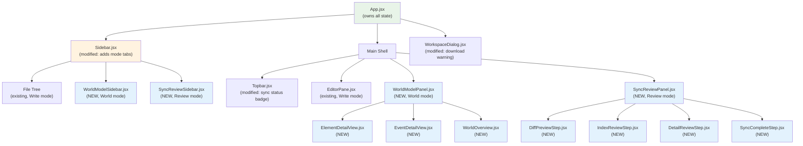

**Legend:** Green = modified existing. Blue = new component. Orange = modified existing (minor).

### 8.2 Component Summary

| Component | Status | Purpose |
|-----------|--------|---------|
| `App.jsx` | Modified | Add `viewMode`, `worldModel`, `syncState`, `reviewSession` state. Conditional rendering of sidebar/main panel content based on viewMode. Download warning logic. |
| `Sidebar.jsx` | Modified | Add mode tab buttons (Write/World) at top. Render file tree OR world sidebar OR review sidebar based on viewMode. |
| `Topbar.jsx` | Modified | Add sync status badge ("World: synced" / "World: 3 unsynced"). |
| `WorkspaceDialog.jsx` | Modified | Add download warning dialog for unsynced state. |
| `WorldModelSidebar.jsx` | **New** | World mode sidebar: sync button, status indicator, searchable elements/events list grouped by kind/chapter. |
| `WorldModelPanel.jsx` | **New** | World mode main panel: routes to overview, element detail, or event detail based on selection. |
| `WorldOverview.jsx` | **New** | Overview dashboard: counts, sync status, last sync time, breakdown, recently updated items. |
| `ElementDetailView.jsx` | **New** | Read-only rendered view of an element detail markdown. Accordion sections. |
| `EventDetailView.jsx` | **New** | Same for events. |
| `SyncReviewPanel.jsx` | **New** | Review mode main panel orchestrator. Renders the appropriate step component based on `reviewSession.step`. |
| `SyncReviewSidebar.jsx` | **New** | Review mode sidebar: Mantine Stepper showing pipeline progress. Cancel button. |
| `DiffPreviewStep.jsx` | **New** | Step 0: file-level diff preview with checkboxes. |
| `IndexReviewStep.jsx` | **New** | Steps 1-2: proposal card display with feedback textarea and approve/reject buttons. Used for both events and elements index review. |
| `DetailReviewStep.jsx` | **New** | Steps 3-4: unified diff display with feedback, approve/reject/skip. Used for both element and event detail review. |
| `SyncCompleteStep.jsx` | **New** | Step 5: sync summary with "Return to World View" button. |

### 8.3 State Management

All state lives in `App.jsx`. No global store (Redux/Zustand) is introduced — this follows the existing pattern and avoids adding dependencies for a single-user tool.

**Persistent state (useLocalStorage):**

```jsx
const [workspace, setWorkspace] = useLocalStorage({
  key: 'editor-app-workspace-v1',
  defaultValue: initialTree,
})

const [worldModel, setWorldModel] = useLocalStorage({
  key: 'editor-app-world-model-v1',
  defaultValue: null,       // null = no world model yet
})

const [syncState, setSyncState] = useLocalStorage({
  key: 'editor-app-sync-state-v1',
  defaultValue: { status: 'never_synced', lastSyncedAt: null, lastSyncedSnapshot: {} },
})
```

**Transient state (useState):**

```jsx
const [viewMode, setViewMode] = useState('editor')      // 'editor' | 'world' | 'review'
const [selectedWorldItemId, setSelectedWorldItemId] = useState(null)  // UUID of selected element/event in World mode
const [selectedWorldItemType, setSelectedWorldItemType] = useState(null)  // 'element' | 'event'
const [reviewSession, setReviewSession] = useState(null) // null when not in review mode
```

**Review session shape (when active):**

```js
{
  step: 'diff-preview',   // 'diff-preview' | 'events-index' | 'elements-index' | 'element-details' | 'event-details' | 'complete'
  diffText: '',            // combined unified diff string
  selectedFileIds: [],     // files chosen in step 0
  changedFiles: [],        // [{fileId, fileName, status, diff}] — computed in step 0

  // Current step state
  currentProposal: null,   // LLM response for the current step
  isLoading: false,
  error: null,
  history: [],             // feedback history for current step

  // Detail step state
  detailTargets: [],       // [{uuid, display_name/summary, delta_action, update_context}]
  currentDetailIndex: 0,
  detailResults: {},       // {uuid: {action: 'approved'|'skipped', updatedMd?: string}}

  // Accumulated results across all steps
  updatedEventsState: null,    // {events_md, detail_files, actions} — after events index apply
  updatedElementsState: null,  // {elements_md, detail_files, actions} — after elements index apply

  // Summary for completion step
  summary: null
}
```

**State flow during sync:**

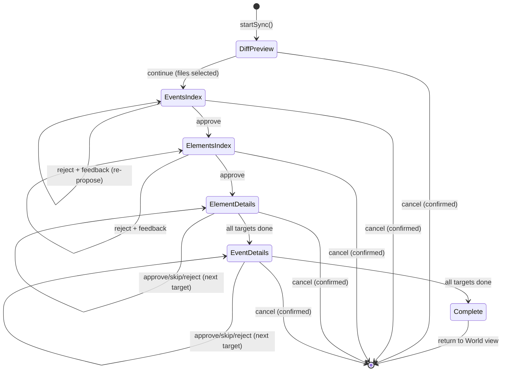

On sync completion, the accumulated results are applied to `worldModel` and `syncState`:

```js
function applySyncResults(reviewSession) {
  // Apply events index changes
  const eventsState = reviewSession.updatedEventsState
  // Re-parse events_md into entries, update worldModel.events

  // Apply elements index changes
  const elementsState = reviewSession.updatedElementsState
  // Re-parse elements_md into entries, update worldModel.elements

  // Apply detail page changes
  for (const [uuid, result] of Object.entries(reviewSession.detailResults)) {
    if (result.action === 'approved') {
      // Update worldModel.*.details[uuid] = result.updatedMd
    }
  }

  // Update sync state
  setSyncState({
    status: 'synced', // or recalculate if some files were excluded
    lastSyncedAt: new Date().toISOString(),
    lastSyncedSnapshot: computeUpdatedSnapshot(workspace, syncState, reviewSession.selectedFileIds)
  })
}
```

### 8.4 New Utility Modules

#### `utils/worldModel.js`

```js
// Parse a pipe-delimited index markdown into { indexPreamble, entries[] }
export function parseIndexMarkdown(markdown, fieldNames)

// Render { indexPreamble, entries[] } back to index markdown
export function renderIndexMarkdown(indexPreamble, entries, fieldNames)

// Create an empty/initial world model state (used on first sync apply)
export function createEmptyWorldModel(elementsPreamble, eventsPreamble)

// Check if a detail file has real content (not all TBD)
export function isDetailPopulated(detailMarkdown)

// Extract a summary/core understanding from a detail markdown (for sidebar preview)
export function extractDetailSummary(detailMarkdown)

// Group elements by kind for sidebar display
export function groupElementsByKind(entries)

// Group events by chapter for sidebar display
export function groupEventsByChapter(entries)
```

#### `utils/diffEngine.js`

```js
// Convert Tiptap HTML content to markdown
export function htmlToMarkdown(htmlString)

// Create a snapshot of all file contents as markdown
export function createContentSnapshot(workspace)

// Compare two snapshots and return changed files
export function getChangedFiles(currentSnapshot, lastSyncedSnapshot)
// Returns: [{ fileId, fileName, filePath, status: 'modified'|'added'|'deleted' }]

// Compute unified diff for a single file
export function computeFileDiff(oldContent, newContent, filePath)
// Returns: { hunks: [...], diffText: string }

// Assemble a combined diff from selected files
export function assembleCombinedDiff(changedFiles, selectedFileIds, currentSnapshot, lastSyncedSnapshot)
// Returns: string (unified diff text for all selected files)
```

#### `utils/agentApi.js`

```js
const API_BASE = 'http://localhost:8000'

// Events index
export async function proposeEventsIndex({ diffText, eventsMd, history })
export async function applyEventsIndex({ eventsMd, proposal })

// Elements index
export async function proposeElementsIndex({ diffText, elementsMd, history })
export async function applyElementsIndex({ elementsMd, proposal })

// Element detail
export async function proposeElementDetail({ diffText, elementsMd, eventsMd, target, currentDetailMd, history })

// Event detail
export async function proposeEventDetail({ diffText, eventsMd, target, currentDetailMd, history })
```

Each function is a thin `fetch` wrapper that handles JSON serialization, error responses, and returns the parsed response body.

#### `utils/projectArchive.js` (modified)

Changes:
- Bump `ARCHIVE_VERSION` to 2
- `exportProjectZip()`: Add `worldModel` and `syncState` to the JSON payload. Add `world-model/` directory with rendered markdown files.
- `importProjectZip()`: Handle v1 (no world model) and v2 (with world model) payloads.
- `validateArchivePayload()`: Extended validation for v2 fields.
- New export: `checkSyncBeforeDownload(syncState)` — returns `{ needsWarning: boolean, changedFileCount: number }` for the download warning flow.

### 8.5 New Dependencies

| Package | Purpose | Size |
|---------|---------|------|
| `turndown` | HTML → Markdown conversion | ~12KB gzipped |
| `diff` (jsdiff) | Unified diff computation | ~8KB gzipped |

Both are mature, well-maintained, zero-dependency libraries.

---

## 9. End-to-End Flows

### 9.1 First Sync (New Project → First World Model)

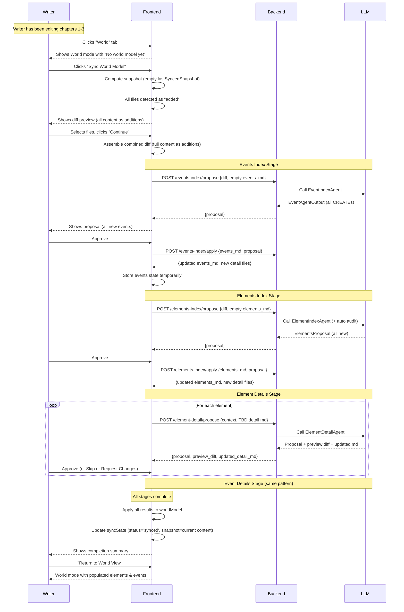

### 9.2 Subsequent Sync (Incremental Update)

The flow is the same as 9.1, with these differences:
- `lastSyncedSnapshot` is populated from the previous sync
- Only changed files appear in the diff preview (not all files)
- The events/elements index markdowns sent to the backend are populated (not empty)
- The LLM agents propose a mix of CREATEs, UPDATEs, and potentially DELETEs
- Detail pages that already have content get incremental updates (not full population from TBD)

### 9.3 Reject + Feedback Loop (One Step in Detail)

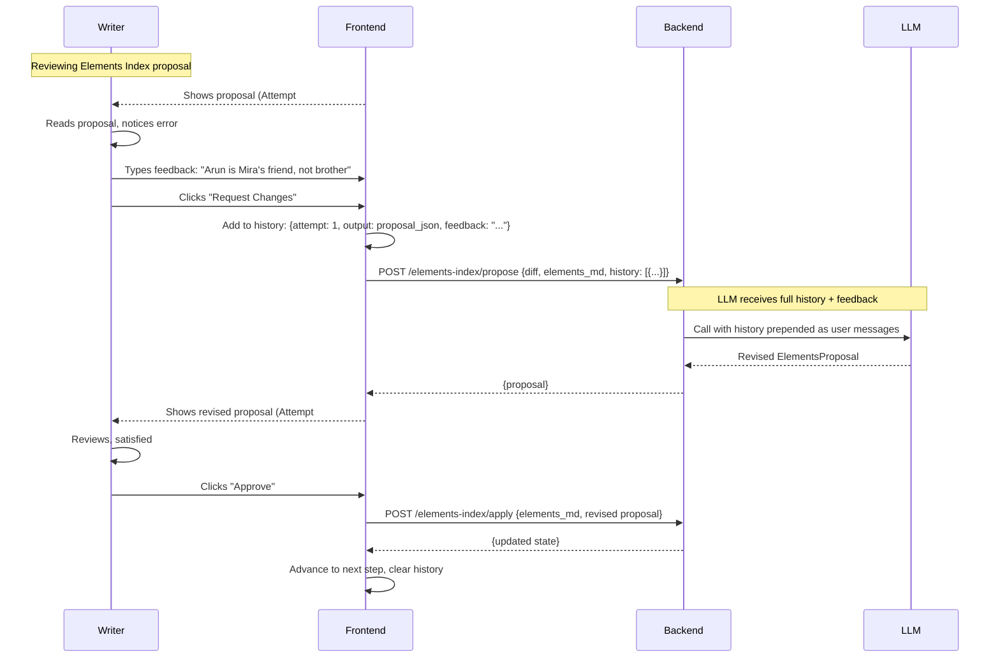

### 9.4 Download with World Model

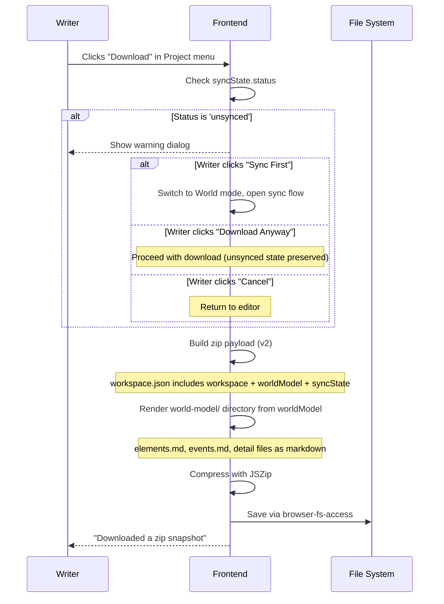

### 9.5 Upload and Resume (Including Unsynced State)

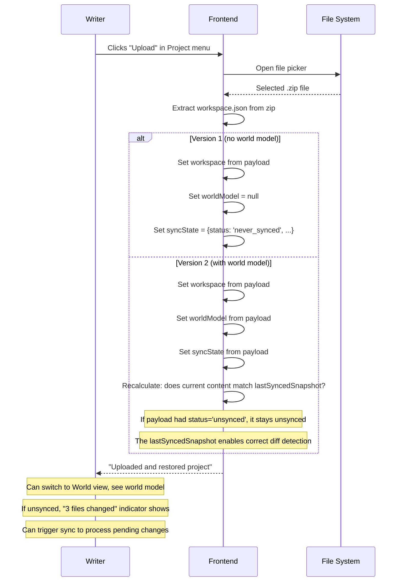

---

## 10. Implementation Phases

The implementation is divided into six phases. Each phase produces a testable increment.

```mermaid
gantt
    title Implementation Phases
    dateFormat  X
    axisFormat %s

    section Phase 1: Data Layer
    World model utils           :p1a, 0, 2
    Diff engine (turndown + jsdiff) :p1b, 0, 2
    Sync state management       :p1c, 1, 3

    section Phase 2: Backend API
    Project structure + harness adaptation :p2a, 2, 4
    Index endpoints (propose + apply)      :p2b, 3, 5
    Detail endpoints (propose)             :p2c, 4, 6
    Error handling + CORS                  :p2d, 5, 6

    section Phase 3: World Mode UI
    Sidebar tabs + view mode switching :p3a, 3, 5
    World sidebar (elements/events list) :p3b, 4, 6
    Element/event detail views         :p3c, 5, 7
    Overview dashboard                 :p3d, 6, 7

    section Phase 4: Sync Review
    Diff preview step              :p4a, 6, 8
    Index review step              :p4b, 7, 9
    Detail review step             :p4c, 8, 10
    Completion + cancel flows      :p4d, 9, 10

    section Phase 5: Zip Integration
    Archive v2 export              :p5a, 9, 11
    Archive v2 import + compat     :p5b, 10, 11
    Download warning flow          :p5c, 10, 11

    section Phase 6: Quick Reference
    Drawer component               :p6a, 11, 12
    Search + condensed detail view :p6b, 11, 12
```

### Phase 1: Data Layer (Foundation)

**Goal:** Establish the data structures, utilities, and state management needed by all other phases.

**Deliverables:**
- `utils/worldModel.js` — Parse/render markdown indexes, group entries, extract summaries
- `utils/diffEngine.js` — HTML→Markdown (turndown), snapshot creation, diff computation, file-level assembly
- State additions in `App.jsx` — `worldModel`, `syncState` with `useLocalStorage`
- Install `turndown` and `diff` npm packages

**Testable:** Can compute diffs between story versions. Can parse/render world model markdown.

### Phase 2: Backend API

**Goal:** Stand up the FastAPI backend with all harness endpoints.

**Deliverables:**
- Backend project structure with harness code adapted from notebook
- All 6 endpoints implemented and manually testable
- CORS configured for localhost
- Error handling for LLM failures

**Testable:** Can call each endpoint via curl/Postman with sample data and get valid responses.

### Phase 3: World Mode UI

**Goal:** The writer can switch to World mode and browse elements/events.

**Deliverables:**
- Mode tab buttons in sidebar (Write/World)
- `WorldModelSidebar.jsx` — elements/events list with grouping and search
- `WorldModelPanel.jsx` — routes to overview or detail view
- `ElementDetailView.jsx`, `EventDetailView.jsx` — rendered detail pages
- `WorldOverview.jsx` — dashboard with counts and status
- Sync status badge in topbar

**Testable:** With manually populated `worldModel` state (from a known-good world model), the writer can browse all elements and events.

### Phase 4: Sync Review Workflow

**Goal:** The complete sync flow from diff preview through completion.

**Deliverables:**
- `SyncReviewPanel.jsx` — step orchestrator
- `SyncReviewSidebar.jsx` — progress stepper
- `DiffPreviewStep.jsx` — file selection with diff display
- `IndexReviewStep.jsx` — proposal rendering, feedback, approve/reject
- `DetailReviewStep.jsx` — diff rendering, feedback, approve/reject/skip
- `SyncCompleteStep.jsx` — summary and return
- Cancel sync confirmation dialog
- Integration with backend API (`utils/agentApi.js`)
- `reviewSession` state management in App.jsx

**Testable:** Full end-to-end sync from the UI, with real LLM calls through the backend.

### Phase 5: Zip Integration

**Goal:** World model and sync state are included in zip downloads and restored on uploads.

**Deliverables:**
- `projectArchive.js` updated for v2 format
- World model markdown files included in zip
- v1 backward compatibility on import
- Download warning dialog for unsynced state

**Testable:** Download a project with world model → clear localStorage → upload the zip → verify world model and sync state are restored.

### Phase 6: Quick Reference Drawer (Phase 2 Feature)

**Goal:** The writer can peek at elements/events while in Write mode without switching to World view.

**Deliverables:**
- Right-side drawer component with searchable element/event list
- Condensed detail view (Core Understanding + key info)
- Keyboard shortcut to open/close
- Button in topbar

**Testable:** Open drawer while editing, search for an element, view its summary, close drawer, continue editing.

---

## 11. Risks & Open Decisions

### 11.1 Risks

| Risk | Impact | Likelihood | Mitigation |
|------|--------|------------|------------|
| **localStorage size limits** | Browsers typically allow 5-10 MB per origin. A large world model (100+ elements with full detail files) + sync snapshot could approach this limit. | Medium (large sagas) | Monitor storage usage. If needed, move to IndexedDB (same API pattern, much larger limits). The `useLocalStorage` hook can be swapped for an IndexedDB wrapper without changing component code. |
| **LLM API reliability** | ChatGroq/Qwen may timeout, rate-limit, or return malformed output during sync. A failed call mid-pipeline could leave the writer stuck. | Medium | All endpoints have timeout handling and retryable error codes. The frontend shows clear error messages with a "Retry" button. Since sync is all-or-nothing, a failure means no partial corruption — the writer just retries or cancels. |
| **HTML → Markdown conversion fidelity** | If `turndown` produces different markdown for semantically identical HTML (e.g., whitespace differences), it could create false "changes detected" alerts. | Low | Use a consistent `turndown` configuration. Normalize whitespace before comparison. Test with real Tiptap output to verify determinism. |
| **Large diffs overwhelming the LLM** | If the writer hasn't synced for a long time and has many chapters of changes, the diff could exceed the LLM's context window or produce low-quality output. | Medium | Show a warning when the diff is very large (e.g., > 5000 lines). Suggest syncing more frequently. Consider chunking in a future version. |
| **Content race condition** | The writer could edit story content in another browser tab while a sync is in progress. The sync would be based on stale content. | Low (single-user tool) | The review mode is modal — the writer can't edit while reviewing. Content is snapshotted at the start of the sync, not read dynamically. |
| **World model markdown format drift** | If the notebook's format evolves (new sections, different delimiters), the frontend's parser could break. | Low | The format is defined in `LayerSpec` and the index preamble, both of which are shared between frontend and backend. Changes to the notebook should be reflected in the backend's spec definitions. |

### 11.2 Open Decisions

| Decision | Options | decision made | Notes |
|----------|---------|----------------------|-------|
| **IndexedDB migration** | (a) Start with IndexedDB now. (b) Start with localStorage, migrate when needed. | (b) Start with localStorage | Simpler. The `useLocalStorage` pattern is already established. Migrate only if size becomes an issue. |
| **LLM provider flexibility** | (a) Hardcode ChatGroq. (b) Make provider configurable via .env. | (a) Hardcode for now | The harness prompts are tuned for Qwen/ChatGroq. Switching providers may require prompt adjustments. Can be made configurable later. |
| **Concurrent sync prevention** | (a) Backend rejects concurrent requests. (b) Frontend prevents concurrent starts. | (b) Frontend-only | Single-user tool. The frontend's `reviewSession` state already prevents starting a second sync. |
| **World model manual editing** | (a) Read-only forever. (b) Allow manual edits via a future helper agent. | (a) Read-only for now | Per requirements. A future "helper agent" feature will be designed separately. |
| **Diff computation location** | (a) Frontend computes diff, sends to backend. (b) Backend computes diff from HTML content. | (a) Frontend computes | Keeps the backend stateless. The frontend already has the content and the turndown/jsdiff libraries. |

---

## Appendix A: Index Preambles (Reference)

The index preamble text is critical because it's part of the LLM prompt — the agents read it as their "operating contract." The preambles used by the harness are stored in the `LayerSpec` definitions and must match between the frontend's initial world model creation and the backend's agent prompts.

These are defined once in the backend's `specs.py` and served to the frontend when a new world model is created (via the first sync's `/apply` response).

## Appendix B: Agent System Prompts (Reference)

The four system prompts (Events Index, Elements Index, Element Detail, Event Detail) are defined in the backend's `prompts.py`. They are not shown here to avoid document bloat, but they are critical to the pipeline's behavior. See `Version-3.ipynb` for the authoritative versions.

---

*End of document.*
